```{r, include=FALSE, message=FALSE, warning=FALSE}

knitr::opts_chunk$set(echo = TRUE)

```


# Question 1: Using the ‘calcium_allL’ dataset please answer the following questions assuming an unstructured covariance pattern:

## a. Describe the missing patterns you see in the data (if any).

We used the xtdescribe command to show the pattern of missingness in the data:

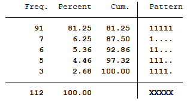
\ 

We see from the table above that 91 people had all five observations, 7 people had only the first observation, 6 people had only the first and second observation, and etc. It appears that people that drop out of the study do not return at a later time. 

## b. Plot the observed data (means and spaghetti plots). What do you observe?

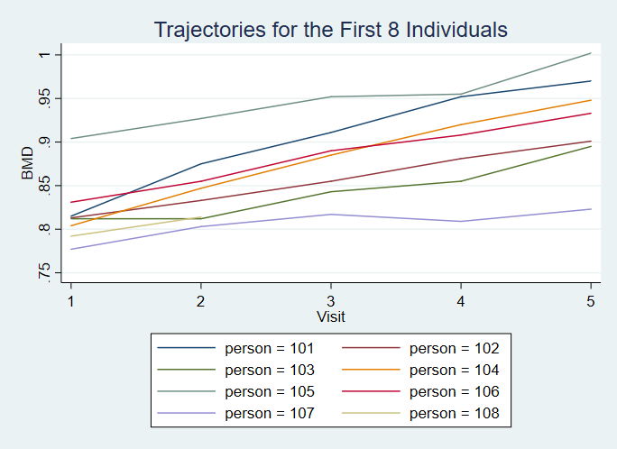
\ 

The spaghetti plot above shows the trajectories for the first 8 individuals. We see that there appears to be an upward trend of bone mineral density over time.

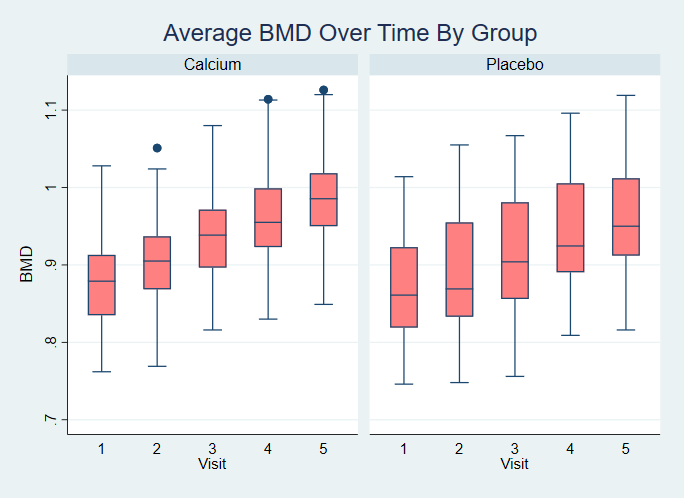
\ 

The boxplots also display an upward trend in bone mineral density. Visually, the calcium group and control group seem to have the same rate of increase. The overall means in the calcium group appear to be higher than the means in the placebo group.

## c. Conduct a Mean Response Profiles analysis (Model 1) with only time and treatment group. What is your overall conclusion about the changes in the mean response over time and the effect of the treatment group on those changes?

The mean response profile uses all variables as categorical and takes the form:

$$ (1) : BMD_i = \beta_0 + \sum_{n=1}^{4}\beta_n visit + \beta_5tx + \sum_{m=6}^{10}\beta_mvisit*tx  + \epsilon_i  $$

The regression result from model (1) is:

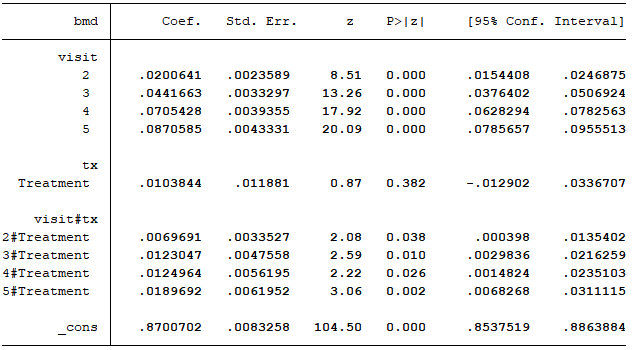
\ 

The regression coefficients are interpreted in detail in Question 4. 

## d. Suppose that you are mainly interested in describing the trends in the mean responses over time adjusting for age. Find a model for the mean that best fits your data.

We start the model selection process with a full marginal model (using time as a continuous predictor) (model2):

$$ (2) : BMD_i = \beta_0 +  \beta_1visit + \beta_2visit^2 + \beta_3tx + \beta_4age + \beta_5tx*visit +\beta_6tx*visit^2 + \beta_7tx*age + \epsilon $$
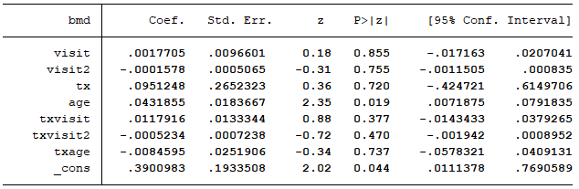
\ 

We see that no predictors are statistically significant in this full model. We then run the model without the interaction between treatment and visit^2 (dropped because of complexity):

$$ (3) : BMD_i = \beta_0 +  \beta_1visit + \beta_2visit^2 + \beta_3tx + \beta_4age + \beta_5tx*visit + \beta_6tx*age + \epsilon $$

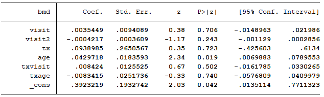
\ 

Again, there are no statistically significant predictors. We decide again to drop the more complicated term, visit^2, and rerun the regression (model4):

$$ (4) : BMD_i = \beta_0 +  \beta_1visit + \beta_2tx + \beta_3age + \beta_4tx*visit + \beta_5tx*age + \epsilon $$

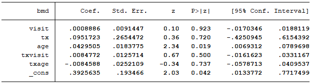
\ 

We see again that non of the predictors are significant at the .05 level. We then decide to drop the least significant interaction term (tx*age) (model5):

$$ (5) : BMD_i = \beta_0 +  \beta_1visit + \beta_2tx + \beta_3age + \beta_4tx*visit  + \epsilon $$

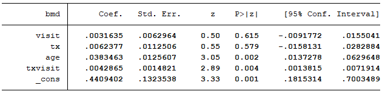
\ 

In model 5, we see that the interaction between treatment and visit is significant as well as the coefficient on age. Since interaction terms lose their interpretability when the individual predictors of the interaction are dropped, we elect to keep visit and treatment in the model, despite the lack of significance. We thus choose model 5 as our best model.

We also check the information criteria for all 5 models:

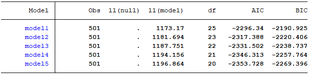
\ 

As expected we see that model 5 has the lowest AIC and BIC. 

# Question 2: : Using the best model from q1 part d try the following covariance patterns:

We rerun our model 5 using seven different covariance structures. Here is the regression output for each:

## a. Unstructured
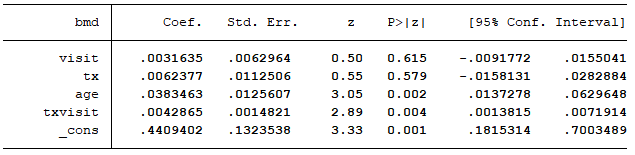
\ 

## b. Exchangable 
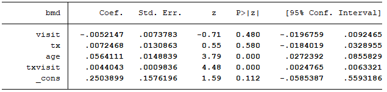
\ 

## c. Autoregressive (1)

\ 

## d. Autoregressive (3)
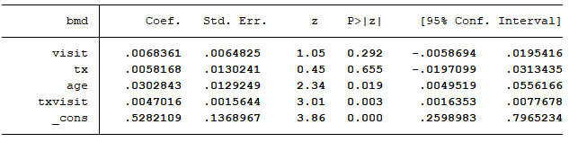
\ 

## e. Toeplitz (1)
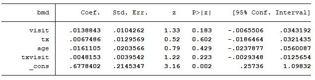
\ 

## f. Toeplitz (3)
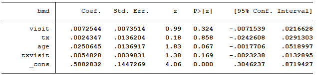
\ 

## g. Toeplitz (4)
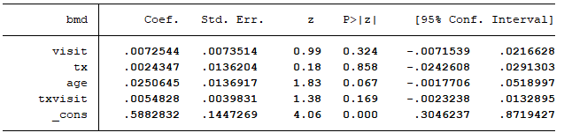
\ 

To choose the best fit from the seven different covariance structures, we examine the information criteria:

 
 \ 
 
 Because it has the lowest BIC, we believe that the model with a 1 period autoregressive covariance structure is the best fit. 
 
# Question 3: Start with a simple model assuming only a linear trend over time, the main effect of treatment, no interaction between time and treatment, and no adjustment for other covariates. 
 
## a,b,c. Select the model that best fits the covariance in your data among the seven options given in question 2.  Then fit the model that best describes the trends in the mean responses over time. Is the final “best” model for your data the same with the one resulted from the process followed in Question 2?

The simplified model is :

$$ BMD_i = \beta_0 + \beta_1visit + \beta_2tx + \epsilon $$
Using the simplified model, we run the regression with the seven different covariance structures from question 2 and examine the information criteria for each regression:

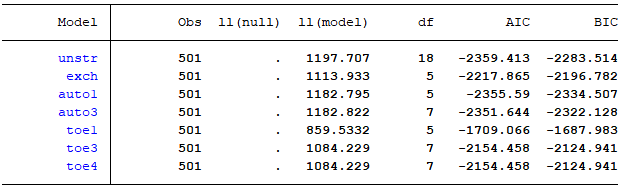
\ 

Again, the model with a 1 period autoregressive covariance structure is the best model, in terms of BIC. Because this matches the conclusion in question 2, this may be evidence that the best covariance structure remains constant despite different predictor choices for nested models, although this point may be coincidence and warrants further investigation. 

# Question 4: Interpret the regression coefficients from Model 1 and the best model(s) for the mean resulted from Q1.d and Q3. What is your final conclusion about the changes in the response over time between the two treatment groups?

***Interpretation for our mean response model (model 1):***

For model 1, the constant, .87, is the mean BMD for the control group at the first visit.

The beta coefficients for visit are the average increase BMD measurements for the placebo group in reference to the first visit. For example, the average BMD was .04 g/cm^2 higher on visit three for the placebo group compared to their first visit.

The coefficient on treatment is the average difference in BMD between the calcium and placebo group at the first visit (not significant). 

The interaction coefficients represent the average difference between the calcium group and the placebo group at each of the follow up visits. For example, the average BMD measurement was .012 g/cm^2 higher for the calcium group at visit 4 than the placebo group.

***Interpretation for our best marginal model from Q1 (model 5):***

Since the data was not centered, the intercept, .44, represents the mean BMD for a 0 year old person in the placebo group. 

The coefficient on visit means that the BMD for each additional visit increased by .003 on average for the placebo group.

The coefficient on treatment means that the average BMD for the treatment group at time zero was .006 g/cm^2 higher than the average in the placebo group (not significant).

The coefficient on age means that for a 1 year increase in age, we expect a .038 increase in BMD measurement on average.

The coefficient on the interaction means that the average marginal increase in BMD is .004 g/cm^2 higher for the calcium group compared to the placebo group.  

***Interpretation for our best marginal model from Q3:***

The intercept, .841, is the average BMD for visit 1 in the placebo group.

The coefficient on visit means that for each additional visit, we expect the BMD level to be .024 g/cm^2 higher.

The coefficient on treatment means that we expect the BMD measurement to be .012 g/cm^2 higher for those in the calcium group compared to the placebo group, all else equal. 

After reviewing the model results, it is clear that the mean BMD measurements are increasing over time for both the calcium group and the control group. Because the interaction is significant in model (5), there is evidence to suggest that the rate of increase in BMD is higher for those taking calcium compared to placebo. 

# Question 5: Using the ‘cd4’ dataset please answer the following questions:

## a. Create spaghetti plots to explore the patterns of the individual trajectories over time, by treatment group. What do you observe?

Here are spaghetti plots for a few individuals, by treatment group:

{width=50%} {width=50%}
\ 

We observe that in both the dual intervention group and the triple intervention group, the individual trajectories vary greatly. Visually, it is difficult to identify a trend. 

## b. Based on the plots of the observed data what model would you prefer to fit to express the changes in the primary outcome (log of CD4 counts) over time and any differences between the two treatment groups? Explain.

Because there is a lot of variation in initial log CD4 levels and individual trends over time, we may prefer a mixed effects model that allows for each individual to have their own intercept and slope. 

# Question 6: Fit a marginal model to describe the trends in the mean responses over time by treatment group. For the mean model consider only a linear trend, and test whether the changes over time are different among the treatment groups without adjusting for any other covariates in the model. For the covariance pattern assume: 

To run these regressions, we changed the week variable into an integer variable (intweek) by rounding all the weeks up.

## a. Exchangeable


\ 

## b. Unstructured

There were too many parameters to estimate for the unstructured covariance matrix.

## c. Auto-regressive (1)

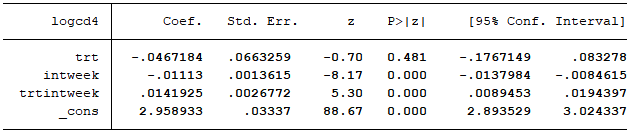
\ 

## d. Toeplitz(1)

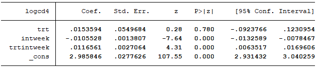
\ 

# What do you observe? Do you think that a marginal model is appropriate for analyzing these data? Explain

The three models that run have statistically significant positive interactions between triple intervention and time, meaning that the marginal increase in log CD4 levels is higher for the triple intervention group than the dual intervention group. Although the conclusion is consistent among all the marginal models, a mixed model may be more appropriate to fit. We see in the spaghetti plots above that many individuals have a negative slope in the treatment group. If we are interested in predictions at the individual level, a mixed model that accounts for individual level characteristics would be a better choice. 

# Question 7: Fit four different models for the covariance in the data, only assuming the following:

## a. A random intercept (model1)
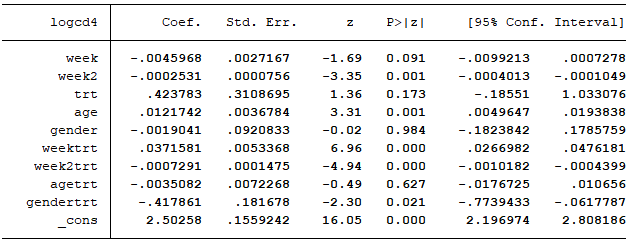
\ 

## b. Random intercept and random slope for time t (model2)
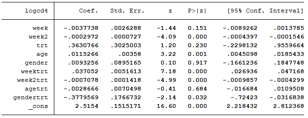
\ 

## c. Random intercept and random slopes for time t, and t^2 (model3)
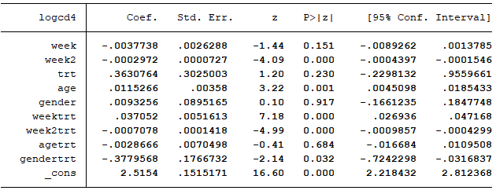
\ 

## d. random intercept and random slopes for time t, t^2 and age (model4)
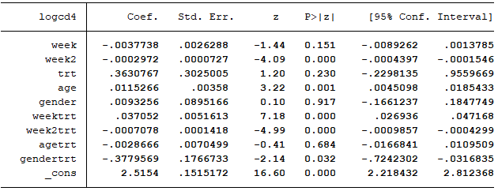
\ 

## e. Can you assume a random slope for gender? Explain.

You can not assume a random slope for gender because gender is constant at all time points. Only time varying covariates can be included in the random part of the model. 

## f. Plot the observed trajectories of four randomly selected individuals; two from the dual and two from the triple therapy. Compare these observed trajectories with the respective model predictions and the linear model mean estimates from each of the four previous models.

Here are the observed vs individual prediction vs marginal prediction trajectories for model 1, by group:

{width=50%} {width=50%}
\ 

The observed vs individual prediction vs marginal prediction trajectories for model 2, by group:

{width=50%} {width=50%}
\ 

The observed vs individual prediction vs marginal prediction trajectories for model 3, by group:

{width=50%} {width=50%}
\ 

Lastly, the observed vs individual prediction vs marginal prediction trajectories for model 4, by group:

{width=50%} {width=50%}
\ 

In all instances, the mixed effects models predictions are closer to the observed predictions for the individual than the marginal model. We also see that including a random slope seems to improve the fit. Among the models with random slopes, it is difficult to determine visually which fits better (they look similar). The plots for the models with random slopes look similar because most of the variation is captured by the random intercepts. For example, here are the random parameters for model 4:

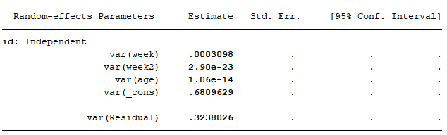

We see that the variance absorbed by the constant is .681, which is much larger than the variance in the slope terms. 

## g. Which of the four models best fits the data? Explain.

We also examine the information criteria for each of the four models:

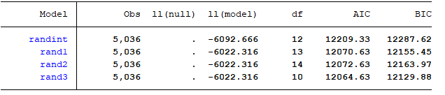
\ 

The more complex model, which includes a random intercept and random slopes on time, time^2, and age has the lowest BIC and AIC. We thus believe that this model is best. 

# Question 8: Based on the best model from the previous question what is your overall conclusion about the effect of the two treatments on the change of the log(CD4) over time?

To recap, here are the results of our best model (model 4): 


\ 

The trend of log CD4 levels over time for the dual intervention group is given by the coefficients on week and week^2. The week coefficient means that log CD4 decreases initially at a rate of .0038. The week^2 coefficient means that the marginal rate of decrease in log CD4 levels is increasing. In other words, the slope starts negative and becomes increasingly more negative over time for the dual intervention group. 

The trend of log CD4 levels over time for the triple intervention group is given by the coefficients on week, week x trt, week^2 and week^2 x trt. Initially, the average log CD4 levels are increasing at a rate of .0334 (week + week x trt). The rate of increase is decreasing over time by .001 (week^2 + week^2 x trt). In other words, the slope for the triple intervention group starts positive but becomes less positive, and eventually negative over time. 

